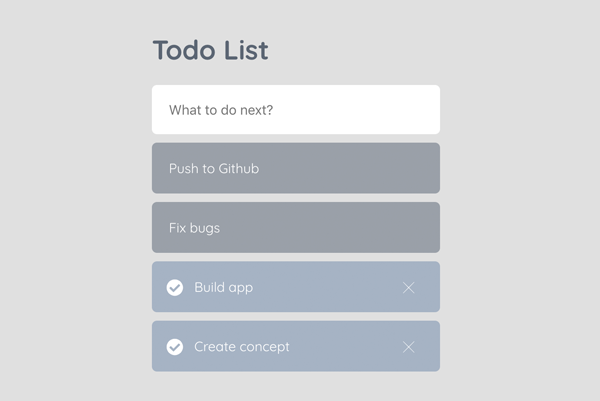

# React Todo List
> Simple ToDo List in React js


My first project in React - If you find anything that could be improved, please let me know. Thanks!





## Installation

```sh
git clone https://github.com/konstantinmuenster/react-todo-list
cd react-todo-list
npm install
npm start
```


## About

Konstantin Münster – [konstantin.digital](https://konstantin.digital) – [mail@konstantin.digital](mailto:mail@konstantin.digital)

Distributed under the [MIT](http://showalicense.com/?fullname=Konstantin+M%C3%BCnster&year=2019#license-mit) license. 
See ``LICENSE`` for more information.

[https://github.com/konstantinmuenster](https://github.com/konstantinmuenster)
